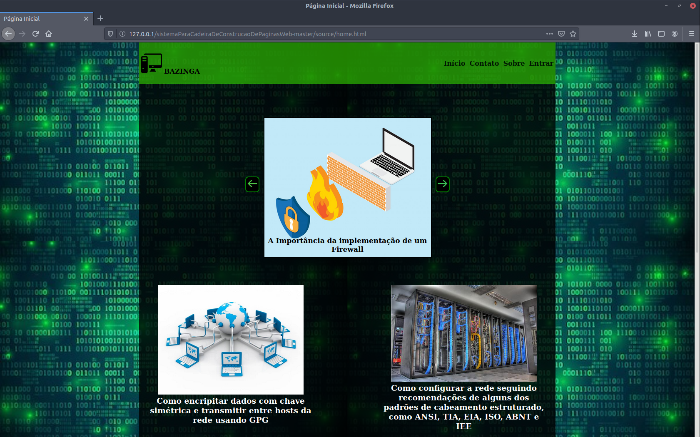
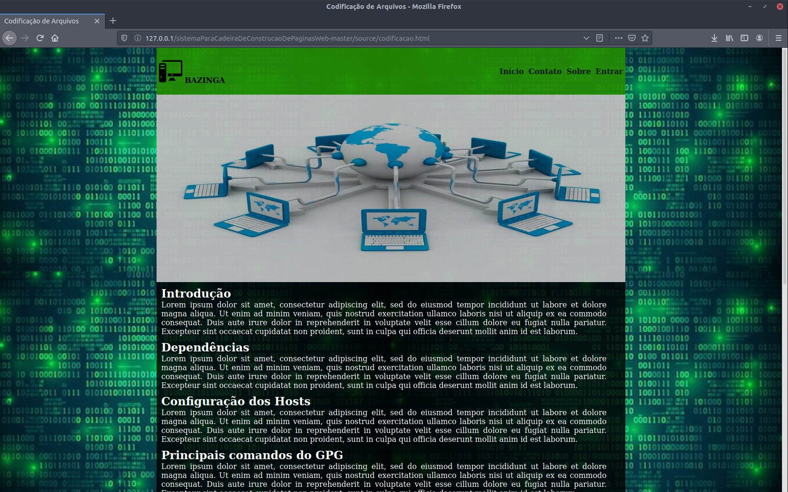
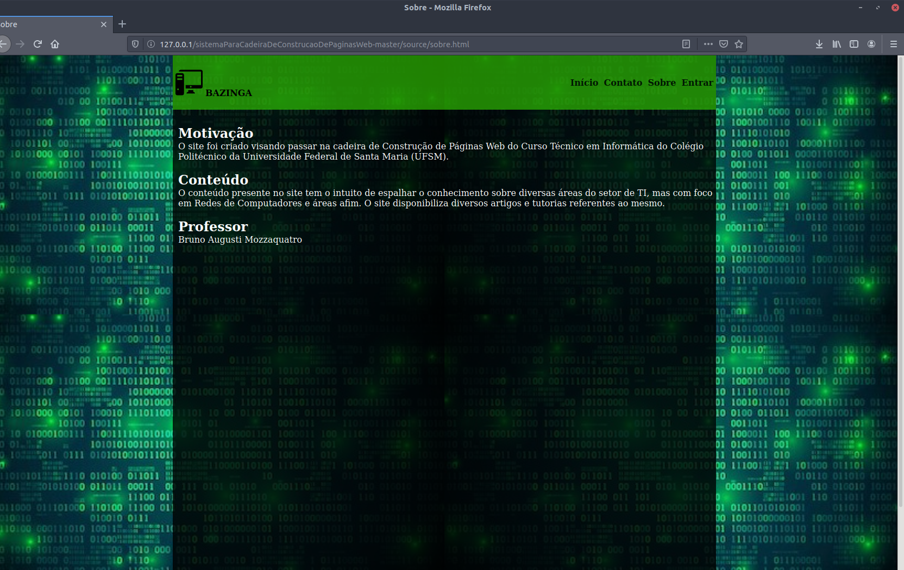
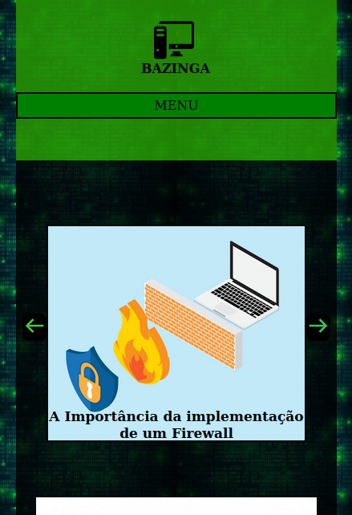

# Sistema Final da Cadeira De Construcao De Paginas Web
Projeto para o fechamento da cadeira de Construção de Páginas Web do Técnico em Informática (sem o uso de frameworks ou de JavaScript)

# Algumas Telas do Sistema
## Desktop

  
  
  

## Mobile

  

